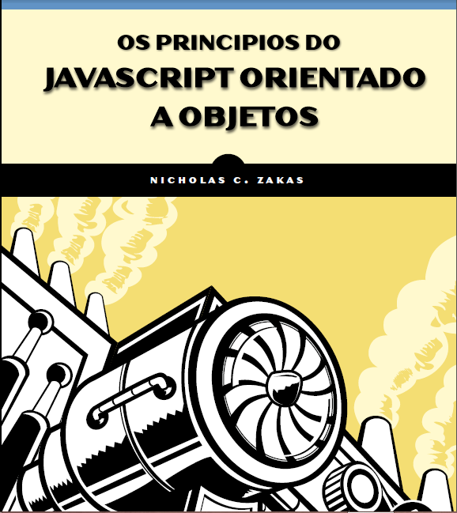

##Tradução do livro "The Principles of Object-Oriented Javascript"

### Notas

Embora este seja um livro comercial, é sabido que este livro nunca chegará nas terras Tupiniquins.
Por esse motivo, decidi traduzir esse livro, que será de enorme ajuda a todos os estudantes de javascript, ja que esse livro aborda o conteúdo mais importante da linguagem.

Vale notar que o padrão ECMAScript 6 substitui o metódo de prototipação pelo uso da palavra-chave "class", já conhecida de outras linguagens, mas ,por enquanto, isso está longe de ser implementado e entender como a prototipação funciona no JavaScript ainda é muito importante.

# Introdução

Muitos desenvolvedores associam programação orientada a objetos com linguagens que são tipicamente ensinadas nas escolas, como C++ e Java, que possuem a orientação a objetos baseada em classes. Antes que você possa fazer qualquer coisa nessas linguagens, você precisa criar uma classe, mesmo que você esteja apenas escrevendo um programa simples na tela de comando.

Os padrões de design da indústria da programação reenforçarão o conceito baseado em classes. Mas JavaScript não usa classes, e esse é um dos principais motivos pelo qual as pessoas ficam confusas quando tentam aprender JavaScript depois de C++ ou Java.

Linguagens orientadas a objetos possuem algumas caracteristicas:

*Encapsulamento :* Dados podem ser agrupados juntos com funcionalidades que operam direto nesses dados. Essa é, basicamente, a definição de um Objeto.

*Agregação :* Um objeto pode referenciar outro objeto.

*Herança :* Um objeto recém-criado possui as mesmas características que outro objeto sem duplicar as mesmas funcionalidades explicitamente.

*Polimorfismo :* Uma interface pode ser implementada por multiplos objetos.

JavaScript possue todas essas características, mas como a linguagem não possue o conceito de classes, algumas dessas características não são implementadas da maneira que você imaginaria. A um primeiro olhar, um programa em JavaScript pode até parecer como a programação procedural que você escreveria em C. Se você pode escrever uma função e passar para ela algumas variáveis, você irá ter um script funcional que aparamentemente não possui objetos. Um olhar mais profundo na linguagem, no entanto, revela a existência de objetos através do uso da notação do ponto (.).

Muitas linguagens orientadas a objetos usam a notação do ponto para acessar propriedades e metódos em objetos, e com JavaScript é sintaticamente o mesmo. Mas em JavaScript, você nunca irá precisar criar uma definição de classe, importar um pacote, ou incluir um arquivo de cabeçalho. Você apenas começar a escrever com os tipos de dados que você quer, e você pode agrupá-los de várias maneiras. Você pode certamente escrever um programa em JavaScript de um modo procedural, mas o verdadeiro poder da linguagem aparece quando você utiliza as vantagens de sua natural orientação a objetos. Esse é o assunto desse livro.

Não se engane: Muitos conceitos que você pode ter aprendido em linguagens orientadas a objetos mais tradicionais não se aplicam necessáriamente em JavaScript. Enquanto muito desses conceitos confudem iniciantes, enquanto você lê, você irá descobrir que a natureza de tipagem fraca de JavaScript permite a você escrever menos código para realizar as mesmas tarefas que você escreveria com mais código em outras linguagens. Você pode simplesmente começar a escrever código sem planejar as classes que você precisa antes de começar.

page 19