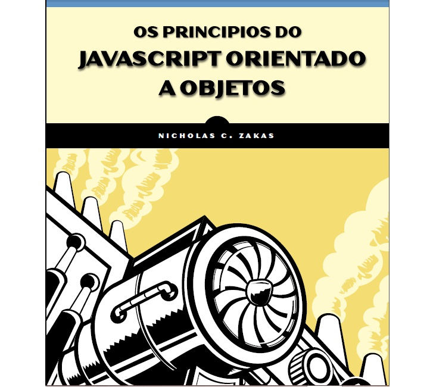
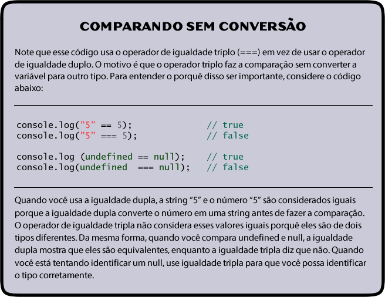
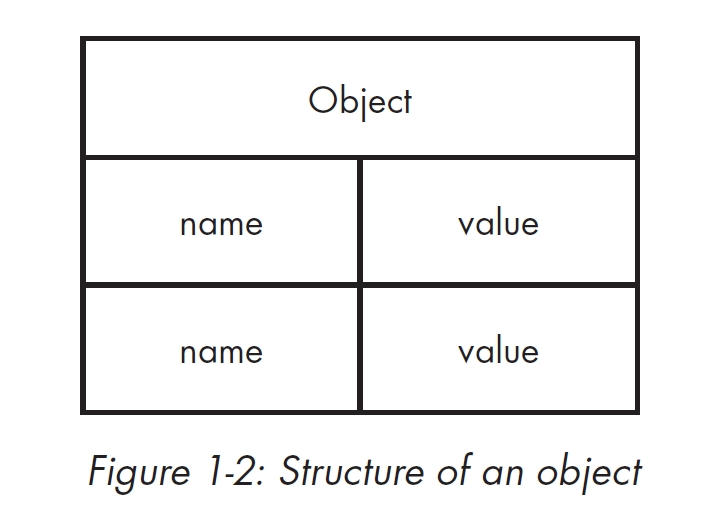
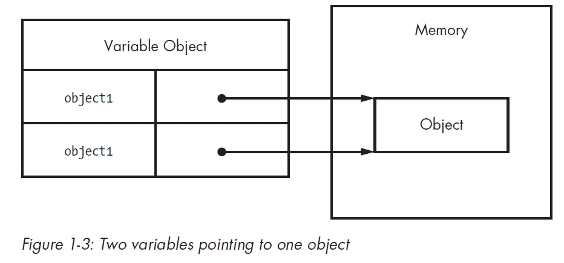

##Tradução do livro "The Principles of Object-Oriented Javascript"

### Notas

Embora este seja um livro comercial, é sabido que este livro nunca chegará nas terras Tupiniquins.
Por esse motivo, decidi traduzir esse livro, que será de enorme ajuda a todos os estudantes de javascript, ja que esse livro aborda o conteúdo mais importante da linguagem.

Vale notar que o padrão ECMAScript 6 substitui o metódo de prototipação pelo uso da palavra-chave "class", já conhecida de outras linguagens, mas ,por enquanto, isso está longe de ser implementado e entender como a prototipação funciona no JavaScript ainda é muito importante.


# Introdução

Muitos desenvolvedores associam programação orientada a objetos com linguagens que são tipicamente ensinadas nas escolas, como C++ e Java, que possuem a orientação a objetos baseada em classes. Antes que você possa fazer qualquer coisa nessas linguagens, você precisa criar uma classe, mesmo que você esteja apenas escrevendo um programa simples na tela de comando.

Os padrões de design da indústria da programação reenforçarão o conceito baseado em classes. Mas JavaScript não usa classes, e esse é um dos principais motivos pelo qual as pessoas ficam confusas quando tentam aprender JavaScript depois de C++ ou Java.

Linguagens orientadas a objetos possuem algumas caracteristicas:

**Encapsulamento :** Dados podem ser agrupados juntos com funcionalidades que operam direto nesses dados. Essa é, basicamente, a definição de um Objeto.

**Agregação :** Um objeto pode referenciar outro objeto.

**Herança :** Um objeto recém-criado possui as mesmas características que outro objeto sem duplicar as mesmas funcionalidades explicitamente.

**Polimorfismo :** Uma interface pode ser implementada por multiplos objetos.

JavaScript possue todas essas características, mas como a linguagem não possue o conceito de classes, algumas dessas características não são implementadas da maneira que você imaginaria. A um primeiro olhar, um programa em JavaScript pode até parecer como a programação procedural que você escreveria em C. Se você pode escrever uma função e passar para ela algumas variáveis, você irá ter um script funcional que aparamentemente não possui objetos. Um olhar mais profundo na linguagem, no entanto, revela a existência de objetos através do uso da notação do ponto (.).

Muitas linguagens orientadas a objetos usam a notação do ponto para acessar propriedades e metódos em objetos, e com JavaScript é sintaticamente o mesmo. Mas em JavaScript, você nunca irá precisar criar uma definição de classe, importar um pacote, ou incluir um arquivo de cabeçalho. Você apenas começar a escrever com os tipos de dados que você quer, e você pode agrupá-los de várias maneiras. Você pode certamente escrever um programa em JavaScript de um modo procedural, mas o verdadeiro poder da linguagem aparece quando você utiliza as vantagens de sua natural orientação a objetos. Esse é o assunto desse livro.

Não se engane: Muitos conceitos que você pode ter aprendido em linguagens orientadas a objetos mais tradicionais não se aplicam necessáriamente em JavaScript. Enquanto muito desses conceitos confudem iniciantes, enquanto você lê, você irá descobrir que a natureza de tipagem fraca de JavaScript permite a você escrever menos código para realizar as mesmas tarefas que você escreveria com mais código em outras linguagens. Você pode simplesmente começar a escrever código sem planejar as classes que você precisa antes de começar. Precisa de um objeto com propriedades específicas? Simplesmente crie um objeto para isso onde você quiser. Você esqueceu de adicionar um método em um objeto? Sem problemas - apenas adicione depois.

Nesse livro, você aprenderá a forma única com que JavaScript lida com a orientação a objetos. Deixe para trás as noções de classes e herança baseada em classes e aprenda sobre a herança baseada em protótipos e construtores de funções que se comportam semelhantemente. Você aprenderá como criar objetos, definir seus próprios tipos, usar herança, e aproveitar as vantagens do uso de objetos ao máximo. Resumindo, você aprenderá tudo que você precisa saber para entender e escrever JavaScript de forma profissional. Divirta-se!

## Público desse livro

O propósito desse livro é ser um guia para aqueles que ja entendem programação orientada a objetos mas desejam saber como isso funciona exatamente em JavaScript. Familiaridade com Java, C#, ou programação orientada a objetos em outras linguagens são um indicador forte de que esse livro é para você.

Em particular, esse livro é feito para 3 grupos de leitores:

- Desenvolvedores que possuem familiaridade com os conceitos de programação orientada a objetos e desejam aplicar eles ao JavaScript
- Desenvolvedores Node.js que desejam estruturar seu código mais eficientemente
- Iniciantes em JavaScript que desejam um conhecimento mais profundo da linguagem

Esse não é um livro para iniciantes que nunca escreveram uma linha de JavaScript. Você precisa de um bom conhecimento sobre como escrever e executar códigos JavaScript para prosseguir com o livro.

## Organização

**Capítulo 1: Tipos primitivos e de referência** oferece uma introdução sobre os dois tipos de valores em JavaScript: primitivos e de referência. Você irá aprender como eles se diferenciam e como entender suas diferenças é importante para um conhecimento geral de JavaScript.

**Capítulo 2: Funções** explica os prós e contras de funções em JavaScript. Funções de primeira classe são o que deixam JavaScript interessante.

**Capítulo 3: Entendendo Objetos** detalha a criação de objetos em JavaScript. Objetos em JavaScript se comportam diferente de objetos em outras linguagens, então um conhecimento profundo sobre como objetos funcionam é vital pra dominar a linguagem.

**Capítulo 4: Construtores e Protótipos** expande a discussão sobre funções olhando mais especificamente nos construtores. Todos os construtores são funções, mas eles são usados de forma diferente. Esse capítulo explora essas diferenças ao mesmo tempo que fala sobre como criar seus próprios tipos.

**Capítulo 5: Herança** explica como a herança é feita em JavaScript. Embora JavaScript não possua classes, isso não significa que a herança seja impossível. Nesse capítulo, você aprenderá sobre herança prototípica e como ela difere da herança baseada em classes.

**Capítulo 6: Padrões de Objetos** discorre sobre padrões comuns de objetos. Há muitas maneiras de criar e compor objetos em JavaScript, e esse capítulo introduz você aos padrões mais populares para fazer isso.

# Capítulo 1: Tipos primitivos e de Referência

Muitos desenvolvedores aprenderem orientação a objetos trabalhando com linguagens baseadas em classes, como Java ou C#. Quando esses desenvolvedores começam a aprender JavaScript, eles ficam desorientados porquê JavaScript não possui um suporte formal para classes. Em vez de definir as classes desde o começo, com JavaScript você apenas cria as estruturas de dados a medida que você precisa delas. Como não há classes, em JavaScript também falta agrupamento de classes, comumente chamados de "pacotes (packages)". Onde em linguagens como Java, pacotes e nomes de classes definem ambos o tipo de objeto e o layout dos arquivos e pastas em seu projeto, programar em JavaScript é como começar com uma folha em branco: Você pode organizar as coisas do jeito que você quiser. Alguns desenvolvedores escolhem por copiar estruturas de outras linguagens, enquanto outros aproveitam a flexibilidade do JavaScript para estruturar de um jeito completamente novo. Para os iniciantes, essa flexibilidade pode ser confusa, mas uma vez que você se acostuma, você verá que JavaScript possui uma flexibilidade que se adapta as suas preferências facilmente.

Para facilitar a transição de linguagens orientadas a objetos tradicionais, em JavaScript os objetos são a parte central da linguagem. Quase todos os dados em JavaScript são ou um objeto ou são acessados através deles. De fato, até funções (em que linguagens tradicionalmente fazem você perder a cabeça para achar referências) são representadas como objetos em JavaScript, o que fazem delas *funções de primeira-classe*.

Trabalhando com objetos e os entender é a chave para entender JavaScript como um todo. Você pode criar objetos a qualquer hora e adicionar ou remover propriedades deles quando quiser. Pra melhorar, objetos JavaScript são extremamente flexiveis e possuem capacidades que criam únicos e interessantes padrões que simplesmente não são possíveis em outras linguagens.

Esse capítulo foca em como identificar e trabalhar com os 2 tipos de dados primários em JavaScript: dados primitivos e dados de referência. Embora ambos são acessados através de objetos, eles se comportam de maneira que fazem com que sejam importante entende-los.

## O Que São Tipos?

Embora JavaScript não possua o conceito de classes, ele utiliza dois tipos: primitivos e referências. *Tipos primitivos* são armazenados como simples tipos de dados. *Tipos de referência* são armazenados como objetos, que são realmente apenas referências para lugares da memória.

O truque é que JavaScript deixa você tratar tipos primitivos como tipos de referência para fazer com que a linguagem seja mais consistente para o desenvolvedor. Enquanto outras linguagens de programação distinguem entre tipos primitivos e de referência armazenando primitivos em stack e referencia no heap, JavaScript some completamente com esse conceito: Ele procura variáveis para um escopo particular com um **objeto variável**. Valores primitivos são armazenados diretamente no objeto variável, que servem de referência para um lugar na memória onde o objeto está armazenado. No entanto, como você verá mais tarde nesse capítulo, tipos primitivos e de referência se comportam um pouco diferente embora eles possam inicializar da mesma maneira. Claro, ainda há outras diferenças entre tipos primitivos e de referência.

## Tipos Primitivos

Tipos primitivos representam simples pedaços de códigos, que são armazenados de forma "as is", como os valores ```true```ou ```25```. Existem cinco tipos de dados primitivos em JavaScript:

**Boolean**		```true``` ou ```false```

**Number**		Qualquer inteiro ou número em ponto flutuante

**String**		Um caractere ou sequência de caracteres delimitados tanto por aspas simples como aspas duplas

**Null**		Um tipo primitivo que só possui um valor: ```null```

**Undefined**	Um tipo primitivo que só possui um valor: ```undefined```.undefined é o valor dado a uma variável não inicializada)

Os três primeiros tipos (Boolean, number e string) se comportam de forma similar, enquanto os dois últimos (null e undefined) se comportam um pouco diferente, e serão discutidos ao longo desse capítulo. Todos os tipos primitivos possuem representações literais de seus valores. *Literais* representam valores que estão armazenados em uma variável, como um nome ou um preço. Aqui estão alguns exemplos de cada tipo com suas formas literais:

```js

//strings
var name = "Nicolas";
var selection = "a";

//number
var count = 25;
var cost = 1.51;

//boolean
var found = true;

//null
var object = null;

//undefined

var flag = undefined;
var ref; //undefined é setado automaticamente

```

Em JavaScript, como em muitas outras linguagens, variáveis contendo um primitivo diretamente possuem o valor primitivo (em vez de um apontador para um objeto). Quando você define um valor primitivo em uma variável, o valor é copiado para essa variável. Isso significa que se você definir uma variável igual a outra, cada variável irá possuir sua própria cópia do valor. Por exemplo:

```js
var cor1 = "vermelho";
var cor2 = cor1;
```


Aqui, ```cor1``` é definida como ```"vermelho"```. A variável ```cor2``` é então definida como o valor de ```cor1```, o que armazena ```"vermelho"``` em cor2. Embora ```cor1``` e ```cor2``` contenham o mesmo valor, eles são completamente separados um do outro, e você pode mudar o valor de ```cor1``` sem afetar ```cor2``` e vice-versa. Isso acontece porquê são dois lugares diferentes de armazenamento, um para cada variável. A Figura 1.1 ilustra o objeto variável para esse trecho de código.

Pelo motivo de que cada variável que contém um valor primitivo usa seu próprio espaço de armazenamento, alterações em uma variável não afetam a outra.
Por exemplo:

```js
var cor1 = "vermelho";
var cor2 = cor1;

console.log(cor1)  // "vermelho"
console.log(cor2)  // "vermelho"

cor1 = "azul";

console.log(cor1) // "azul"
console.log(cor2) // "vermelho"
```

Nesse código, ```cor1``` é alterada para ```"azul"``` e ```cor2``` permanece com seu valor original ```"vermelho"```

## Identificando Tipos Primitivos

A melhor maneira de identificar tipos primitivos é com o operador ```typeof```, que funciona em qualquer variável e retorna uma string indicando o tipo de dado. O operador ```typeof``` funciona bem com strings, number, Booleans e undefined. O código abaixo mostra a saída quando usando o operador ```typeof``` em diferentes valores primitivos:

```js
console.log(typeof "Nicolas");  // "string"
console.log(typeof 10);         // "number"
console.log(typeof 5.1);        // "number"
console.log(typeof true);       // "boolean"
console.log(typeof undefined);  // "undefined"
```
Como você ja devia estar esperando, ```typeof```retorna ```"string"``` quando o valor é uma string; ```number``` quando um valor é um número (independente de ser um inteiro ou um float); ```boolean``` quando o valor é um Boolean; e ```undefined```quando o valor é undefined.

A parte confusa envolve o ```null```.
Você não seria o primeiro desenvolvedor a se confundir com o resultado desta linha de código:

```js
console.log(typeof null);  // "object"
```

Quando você executa ```typeof null```o resultado é ```"object"```. Mas porquê um objeto quando o tipo é ```null```? (De fato, isso foi reconhecido como um erro pelo TC39, um comitê que faz o design e mantêm o JavaScript. Você poderia argumentar que ```null``` é uma refêrencia vazia a um objeto, fazendo com que ```object``` seja um valor de retorno correto, porém ainda assim é confuso.)
A melhor maneira de determinar se um valor é ```null``` é comparar ele com ```null``` direto, como assim:

```js
console.log(value === null);  // "true" ou "false"
```



## Metódos Primitivos

Além do fato de que eles são tipos primitivos, strings, numbers e Booleans possuem métodos. (```null``` e ```undefined``` não possuem métodos). Strings, em particular, possuem vários métodos para ajudar você a trabalhar com elas. Por exemplo:

```js

var name = "Nicolas"
var lowercaseName = name.toLowerCase();   // Converte para minúsculo
var firstLetter   = name.chartAt(0);      // Pega o primeiro caractere
var middleOfName  = name.substring(2,5)   // Pega os caracteres de 2 a 4

var count = 10;
var fixedCount    = count.toFixed(2);     // Converte para "10.00"
var hexCount      = count.toString(16);   // Converte para "a"

var flag = true;
var stringFlag    = flag.toString();      // Converte para "true"

```

*Lembre-se que os métodos em tipos primitivos não mudam o contéudo original. Por exemplo: após usar name.toLowerCase(); no exemplo anterior, a variável name original continuará a mesma com uma letra maiuscula. Se você quiser mudar o conteudo, teria que fazer name = name.toLowerCase();*

*Além do fato de eles possuirem métodos, valores primitivos não são objetos. JavaScript faz eles parecerem com objetos para oferecer uma experiência consistente na linguagem, como você verá mais tarde nesse capítulo.*

## Tipos de referência

Tipos de referência representam objetos em JavaScript e eles são as coisas mais próximas de classes que você irá encontrar na linguagem. Valores de referência são *instâncias* de tipos de referência e são sinônimos de objetos (o resto desse capítulo referência valores de referência simplesmente como *objetos*). Um objeto é uma lista desordenada de propriedades consistindo de um nome (sempre uma string) e um valor. Quando o valor de uma propriedade é uma função, ela é chamada de *método*. As funções propriamente ditas são na verdade valores de referência em JavaScript, então há pouca diferença em uma propriedade que contém um array e uma que contém uma função exceto que a função pode ser executada.
E claro, você precisa criar objetos antes de começar a trabalhar com eles.

### *Criando Objetos* 




Às vezes ajuda a pensar em objetos de JavaScript como nada mais que uma tabela de valores, como na figura 1-2.
Existem algumas maneiras de criar, ou *instanciar* um objeto. O primeiro é usar o operador ```new``` com um construtor. (Um construtor é simplesmente uma função que usa ```new``` para criar um objeto -- qualquer função pode ser um construtor.) Pela convenção, construtores em JavaScript iniciam com uma letra maiúscula para distinguir de funções que não são construtoras. Por exemplo, esse código instancia um objeto genérico e armazena a referência a ele em ```object```:

```js
var objeto = new Object();
```

Tipos de referência não armazenam o objeto diretamente na variável em que são definidas, então a variável ```objeto``` nesse exemplo não contém a instância de objeto. Em vez disso, ela possui um apontador (ou referência) para o lugar da memória onde esse objeto existe. Essa é a principal diferença entre objetos e valores primitivos, pois valores primitivos são armazenados diretamente na variável em que são definidos. Quando você define um objeto em uma variável, você está na verdade definindo uma referência a esse objeto (como um ponteiro). Isso significa que se você definir uma variável em outra, cara variável possue uma cópia dessa referência, e ambos referenciam o mesmo objeto na memória. Por exemplo:

```js
var objeto1 = new Object();
var objeto2 = objeto1;
```
Esse código primeiro cria um objeto (com ```new```) e então armazena a referência em ```objeto1```. Depois, ```objeto2``` é definido como o valor de ```objeto1```. Ainda há somente a única instância do objeto que foi criado na primeira linha, mas ambas variáveis agora apontam para esse objeto, como na figura 1-3:



### *Desreferênciando objetos*

JavaScript possui um coletor de lixo, então você não precisa  realmente se preocupar com alocações de memória quando você usar tipos de referência. Entretanto, é melhores *desreferênciar* objetos que você não precisa mais para que o coletor de lixo possa liberar aquela memória. A melhor maneira de fazer isso é definir a variável do objeto como ```null```.

```js

var objeto1 = new Object();

//faça algo

objeto1 = null;    //desreferência

```

Aqui, ```objeto1``` é criado e usado antes de finalmente ser definido como ```null```. Quando não há mais referências para um objeto na memória, o coletor de lixo pode usar aquela memória para algo diferente. (Desreferênciar objetos é especialmente importante em grandes aplicações que usam milhões de objetos.)

### *Adicionando ou Removendo Propriedades*

Outro aspecto interessante de objetos em JavaScript é que você pode adicionar ou remover propriedades a hora que quiser. Por exemplo:

```js

var objeto1 = new Object();
var objeto2 = objeto1;

objeto1.minhaPropriedade = "Incrível!";
console.log(objeto2.minhaPropriedade);   // "Incrível!"
```

Aqui, ```minhaPropriedade``` é adicionada a objeto1 com o valor de "Incrível!". Essa propriedade também é acessível em ```objeto2``` porque ambos ```objeto1``` e ```objeto2``` apontam para o mesmo objeto.

*Esse exemplo demonstra uma particularidade única de JavaScript: você pode modificar objetos quando você quiser, mesmo se você não definiu eles em primeiro lugar. Existem maneiras de previnir essas modificações, como você verá mais a frente nesse livro*

Além dos tipos de referência genéricos, JavaScript possui outros tipos próprios da linguagem ao seu dispor.

## Instânciando Tipos Próprios

Você viu como criar e interagir com objetos genéricos criados com ```new Object()```. O tipo ```Object``` é somente uma de uma larga variedade de tipos de referência que JavaScript dispoe. Os outros tipos próprios são mais especializados em seu uso pretendido e podem ser instânciados a qualquer hora. Os tipos próprios são:

**Array**:    Uma lista ordenada numericamente de valores indexados
**Date**:     Uma data e uma hora
**Error**:    Um erro de execução (existem mais subtipos de error)
**Function**: Uma função
**Object**:   Um objeto genérico
**RegExp**:   Uma expressão regular

Você pode instânciar cada tipo próprio usando ```new```, como mostrado aqui:

```js

var itens  = new Array();
var agora  = new Date();
var erro   = new Error("Algo errado aconteceu");
var func   = new Function("console.log("hi")";);
var objeto = new Object();
var re     = new RegExp("\\d+");

```

### *Formas literais*

A maioria dos tipos próprios possuem formas literais. Uma forma *literal* é uma sintaxe que permite você definir um valor de referência sem criar um objeto explicitamente, usando o operador ```new``` e o objeto construtor. (Antes, nesse capítulo, você viu exemplos de literais primitivos incluindo strings literais, literais numéricos, literais booleanos, o literal ```null```, e o literal ```undefined```).

### *Literais de Objetos e Arrays*

Para criar um objeto com a sintaxe de objeto literal, você pode definir as propriedades de um novo objeto dentro de chaves. Propriedades são feitas de um identificador ou string, dois pontos, e um valor, sendo várias propriedades divididas com vírgula. Por exemplo:

```js

var livro = {
	nome: "Os Princípios da orientação a objetos em JavaScript",
	ano: 2014
};

```

Você também pode usar strings literais para nomes de propriedades, o que é muito útil se você quer definir o nome de uma propriedade com espaços ou caracteres especiais:

```js

var livro = {
	"nome": "Os Princípios da orientação a objetos em JavaScript",
	"ano": 2014
};

```
Esse exemplo é equivalente ao anterior, apesar das diferenças sintáticas. Ambos os exemplos também são logicamente equivalentes a esse:

```js
var livro = new Object();
livro.nome = "Os Princípios da orientação a objetos em JavaScript";
livro.ano = 2014;

```
O resultado final de cada um dos três exemplos anteriores são os mesmos: um objeto com duas propriedades. A escolha do padrão a ser usado é deixada para você, porquê as funcionalidades são as mesmas.

*Usar um literal de objeto não chama propriedade ```new Object()```. Em vez disso, a engine do JavaScript segue os mesmos passos de quando usa ```new Object()``` sem chamar o construtor. Isso se repete em todas as formas literais.*

Você pode definir um literal de array de forma semelhante colocando qualquer número de valores separados por vírgula dentro de colchetes. Por exemplo:

```js

var cores = [ "vermelho", "azul", "verde" ];
console.log(cores[0]);   // "vermelho"

```
Esse código é o equivalente a esse:

```js

var cores = new Array("vermelho", "azul", "verde");
console.log(cores[0])    // "vermelho"

```
### *Literais de Funções*

Você quase sempre define funções usando sua forma literal. De fato, usar o construtor ```Function``` é normalmente desaconselhado por ser mais dificil de manter, ler e debugar uma string de código do que o código em si.
Criar funções são muito mais simples e menos propensas a erro usando sua forma literal. Por exemplo:

```js

function reflect(value) {
	return value;
}

// é a mesma coisa que:

var reflect = new Function("value", "return value;");

```

Esse código define a função ```reflect()```, que retorna qualquer valor passado a ela. Mesmo no caso dessa função simples, a forma literal é mais fácil de escrever e entender do que usando a forma do construtor. Além disso, não há maneira eficiente de debugar funções que são criadas com a forma do construtor: Essas funções não são reconhecidas por debugadores de JavaScript fazendo assim com que ajam como caixas pretas na sua aplicação.

### Literais de Expressões Regulares

JavaScript também possui literais para expressões regulares que permitem a você definir expressões regulares sem usar o construtor ```RegExp```. Literais de expressões regulares se parecem muito com as expressões regulares em Perl: a expressão é contida dentro de duas barras, e qualquer opção adicional é uma única letra após a segunda barra. Por exemplo:

```js

var numeros = /\d+/g;

// é o mesmo que:

var numeros = new RegExp("\\d+", "g");

```

A forma literal de expressões regulares em JavaScript são melhores de lidar do que usar a forma do construtor porquê você não precisa se preocupar com caracteres de escape dentro de strings. Quando usando o construtor ```RegExp```, você passa a expressão em uma string, então você precisa usar o escape em qualquer barra invertida (esse é o motivo de ```\d``` ser usado na forma literal e ```\\d``` no construtor).
Literais de expressões regulares são preferíveis no lugar da forma do do construtor exceto quando a expressão regular está sendo construido dinamicamente de uma ou mais strings.
Dito isso, com exceção de ```Function```, não há realmente uma maneira certa ou errada de instanciar tipos próprios. Muitos desenvolvedores preferem literais, enquanto outros preferem construtores. Escolha o método que você se sentir mais confortável em usar.

## Acesso de Propriedades

Propriedades são pares de nomes/valores que são armazenados em um objeto. A notação de ponto é a forma mais comum de acessar propriedades em JavaScript (e em muitas linguagens orientadas a objetos), mas você pode também acessar propriedades em JavaScript usando a notação de colchetes com uma string.
Por exemplo, você poderia escrever esse código, que usa a notação de ponto:

```js

var array = [];
array.push(12345);

```

Com a notação de colchetes, o nome do método é agora incluído em uma string dentro de colchetes, como no exemplo:

```js

var array= [];
array["push"](12345);

```
Essa sintaxe é muito útil quando você decidir dinamicamente qual propriedade acessar. Por exemplo, aqui a notação de colchetes permite você usar uma variável em vez de uma string literal para especificar a propriedade a ser acessada:

```js

var array = [];
var method = "push";
array[method](12345);

```

Nesse exemplo, a variável ```method``` tem o valor de ```"push"```, então ```push()``` será chamada no array. Essa funcionalidade é muito útil, como você verá mais a frente nesse livro. O que é preciso ser lembrado é que, além da sintaxe, a única diferença entre a notação de ponto e a notação de colchetes é que a notação de colchetes permite a você usar caracteres especiais em nomes de propriedades. Desenvolvedores normalmente acham a notação de ponto mais fácil de ler, então você verá ela sendo mais usada que a notação de colchetes.

## Identificando Tipos de Referência

Uma função é o tipo de referência mais fácil de identificar porque quando você usa o operador ```typeof``` em uma função, ele deve retornar ```"function"```:

```js

function reflect(value) {
	return value;
}

console.log(typeof reflect);     // "function"

```
Outros tipos de referência podem ser difíceis de identificar porque, para qualquer outros tipos de referência que não sejam funções, o operador ```typeof``` retorna ```"object"```.
Isso não é de grande ajuda quando você está lidando com vários tipos diferentes. Para identificar tipos de referencia mais facilmente, você pode usar o operador ```instanceof``` de JavaScript.
O operador ```instanceof``` pega um objeto e um construtor como parâmetros. Quando o valor é do tipo do construtor especificado, o operador ```instanceof``` retorna ```true```. Caso contrário, ele retorna ```false```, como você pode ver aqui:

```js

var items = [];
var object = {};

function reflect(value) {
	return value;
}

console.log(items instanceof Array);      	// true
console.log(object instanceof Object);    	// true
console.log(reflect instanceof Function); 	// true

```

Nesse exemplo, diversos valores são testados usando ```instanceof``` e um construtor. Cada tipo de referência é identificado corretamente usando o operador ```instanceof``` e um construtor que representa seu tipo verdadeiro (mesmo que o construtor não seja usado na criação da variável).

O operador ```instanceof``` pode identificar tipos herdados. Isso significa que cada objeto é na verdade uma instância de ```Object``` porquê cada tipo de referência herda de ```Object```. Para demonstrar, o próximo exemplo examina as três referências criadas anteriormente com ```instanceof```:

```js

var items = [];
var object = {};

function reflect(value) {
	return value;
}

console.log(items instanceof Array);             	// true
console.log(items instanceof Object); 		 		// true
console.log(object instanceof Object);				// true
console.log(object instanceof Array);				// false
console.log(reflect instanceof Function);			// true
console.log(reflect instanceof Object);				// true

```

Cada tipo de referência é identificado corretamente como instância de ```Object```, da qual todos os tipos de referência são herdados.

## Identificando Arrays

Embora ```instanceof``` possa identificar arrays, há uma exceção que afeta desenvolvedores web: valores em JavaScript podem ser passados entre <frame> na mesma página. Isso se torna um problema somente quando você tenta identificar o tipo de um valor de referência, porque cada página possui seu próprio contexto global - sua própria versão de ```Object```,```Array```, e todos os outros tipos próprios. Como resultado, quando você passa um array de um frame para outro, ```instanceof``` não funciona porquê o array é na verdade uma instância de ```Array``` de uma frame diferente.
Para corrigir esse problema, ECMAScript 5 introduziu ```Array.isArray()```, o qual identifica definitivamente se o valor é uma instância de ```Array``` sem se importar com seu valor de origem. Esse método deve retornar ```true``` quando recebe um valor que é um array nativo de qualquer contexto. Se o seu ambiente de desenvolvimento suporta ECMAScript 5, ```Array.isArray()``` é o melhor jeito de identificar arrays:

```js

var items = [];

console.log(Array.isArray(items));    //true

```
O método ```Array.isArray()``` é suportado na maioria dos ambientes de desenvolvimentos, ambos em browsers e em Node.js. Esse método não é suportado no Internet Explorer 8 e anteriores.

## Tipos Wrapper Primitivos

Talvez uma das partes mais confusas de JavaScript é o conceito de *tipos wrapper primitivos*. Existem três tipos wrapper primitivos: ```String```, ```Number``` e ```Boolean```. Esses tipos de referência especiais existem para fazer com que trabalhar com valores primitivos sejam tão fáceis como trabalhar com objetos (seria muito confuso se você tivesse que usar uma sintaxe diferente ou trocar para o estilo de programação procedural somente para pegar uma substring de um texto).
Os tipos wrapper primitivos são tipos de referência que são criados automaticamente por baixo dos panos sempre que strings, numbers ou Booleans são lidos. Por exemplo, na primeira linha do próximo exemplo, um valor primitivo de string é definido em ```nome```. A segunda linha trata ```nome``` como um objeto e chama ```charAt(0)``` usando a notação de ponto:

```js

var nome = "Nicolas";
var primeiroCaractere = nome.charAt(0);
console.log(primeiroCaractere);               // "N"

```

Isso é o que acontece em baixo dos panos:

```js

// O que a engine de JavaScript faz
var nome = "Nicolas";
var temp = new String(name);
var primeiroCaractere = temp.charAt(0);
temp = null;
console.log(primeiroCaractere);     		   // "N"

```

Porquê a segunda linha (do primeiro exemplo) usa uma string (que é um primitivo) como um objeto, a engine de JavaScript cria uma instância de ```String``` para que então ```charAt(0)``` funcione. O objeto ```String``` existe somente em uma instrução antes de ser destruído (um processo chamado de *autoboxing*). Para testar isso, tente adicionar uma propriedade em uma string como se ela fosse um objeto comum:

```js

var nome = "Pietro";
nome.sobrenome = "Pereira";

console.log(nome.sobrenome);				// undefined

```

Esse código tenta adicionar a propriedade ```sobrenome``` na string ```nome```. O código funciona normalmente exceto que a propriedade desaparece. O que aconteceu? Quando trabalhando com objetos, você pode adicionar propriedades a qualquer hora e elas irão continuar lá até você remover elas manualmente. Com tipos wrapper primitivos, propriedades parecem desaparecer porquê o objeto em que a propriedade foi definida foi destruido imediatamente depois.

Aqui está o que realmente aconteceu na engine do JavaScript:

```js

// O que a engine do JavaScript faz
var nome = "Pietro":
var temp = new String(nome);
temp.sobrenome = "Pereira";
temp = null;

var temp = new String(nome);
console.log(temp.sobrenome);
temp = null;

```

Em vez de definir uma nova propriedade para a string, o código na verdade cria uma nova propriedade em um objeto temporário e então é destruído. Quando você tenta acessar aquela propriedade depois, um objeto temporário diferente é criado e a nova propriedade não existe nele. Embora valores de referência são criados automaticamente para valores primitivos, quando ```instanceof``` checa o tipo desses valores, o resultado é ```false```:

```js

var nome = "Pietro";
var count = 10;
var found = false;

console.log(nome instanceof String);		// false
console.log(count instanceof Number);		// false
console.log(found instanceof Boolean);		// false

```

O operador ```instanceof``` retorna ```false``` porquê um objeto temporário é criado somente quando um valor é lido. E porquê ```instanceof``` na verdade não lê nada, nenhum objeto temporário é criado, e ele nos diz que esses valores não são instâncias de tipos wrapper primitivos. Você pode criar tipos wrapper primitivos manualmente, mas há alguns efeitos colaterais:

```js

var nome = new String("Pietro");
var count = new Number(10);
var found = new Boolean(false);

console.log(typeof nome);			// "object"   			
console.log(typeof count);			// "object" 
console.log(typeof found);			// "object" 


```

Como você pode ver, criar uma instância de um tipo wrapper primitivo apenas cria outro objeto, o que significa que ```typeof``` não pode identificar o tipo de dado que você pretende armazenar.
Além de que você não pode usar ```String```, ```Number``` ou ```Boolean``` como você usaria valores primitivos. Por exemplo, o próximo código usa um objeto ```Boolean```. O objeto ```Boolean``` é falso, ainda assim ```console.log("Found")``` ainda é executado porquê um objeto sempre será considerado ```true``` dentro de instruções condicionais. Não importa se o objeto representa ```false```, ele é um objeto, então será validado como ```true```.

```js

var found = new Boolean(false);

if (found) {
	console.log("Found");     // isso é executado
}

```

Instânciar manualmente tipos wrapper primitivos também pode ser confuso de outras maneiras, a menos que você ache um caso especial onde faz sentido fazer isso, você deve evitar. Na maioria dos casos, usar objetos wrappers primitivos em vez de primitivos somente leva a cometer erros.

## Sumário

Embora JavaScript não possua classes, ele possui tipos. cada variável ou pedaço de dado é associado a um tipo primitivo ou de referência específico. Os cinco tipos primitivos (strings, numbers, Booleans, null e undefined) representam valores simples armazenados diretamente no objeto variável em um determinado contexto. Você pode usar ```typeof``` para identificar tipos primitivos com exceção de ```null```, o qual deve ser comparado diretamente com o valor especial ```null```. 
Tipos de referência são a coisa mais próxima de classes em JavaScript, e objetos são instâncias de tipos de referências. Você pode criar novos objetos usando o operador ```new``` ou uma forma literal. Você pode acessar propriedades e métodos usando a notação de ponto ou colchetes. Funções são objetos em JavaScript, e você pode identificar elas usando o operador ```typeof```. Você deve usar o operador ```instanceof``` com um construtor para identificar objetos de outros tipos de referência.
Para fazer com que primitivos se pareçam com referências, JavaScript possui três tipos wrapper primitivos: ```String```, ```Number``` e ```Boolean```. JavaScript cria esses objetos por baixo dos panos para que você possa tratar primitivos como objetos regulares, mas objetos temporários são destruidos assim que a instrução que usa ele é completada. Embora você possa criar suas próprias instâncias de wrappers primitivos, é melhor não fazer isso porque pode ser confuso.


# Funções

